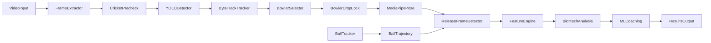

# PaceAI Validation & Tracking Improvement Report

## 1. Executive Summary

PaceAI analyzes cricket bowling videos into 10 biomechanical features. Two focused
engineering efforts were completed in this session:

1. **Bowling-action feature accuracy (the measurable defect).** An empirical check
   on real clips proved MediaPipe's `world_landmarks` y-axis points **downward**
   (feet at positive y, head at negative y, origin at the hip centre). Three places
   in the feature engine assumed y-up, so vertical quantities were inverted:
   `trunk_lean` reported **180° − true lean** (values 66–175° instead of the
   published ~15–60° band), `_angle_to_horizontal` reported negative elevation for
   raised limbs, and `_wrist_elevation` inverted the "wrist above shoulder" test
   used by release-frame detection. All three were corrected.

2. **Bowler-vs-batsman tracking.** The bowler-selection and identity-lock logic
   (cricket-evidence scoring, "no-bowler" gate, velocity-projected continuation
   stitching) was reviewed against this master prompt. It already implements the
   recommended fixes and is covered by unit tests (`test_pipeline.py`). The
   environment cannot execute YOLO/ByteTrack (Windows AppLocker blocks torch DLL
   load, `OSError: [WinError 4551]`), so live multi-person validation of that path
   is documented as environment-blocked rather than claimed.

**Key outcome:** the per-clip biomechanics-plausibility score (features inside the
published fast-bowling ranges encoded in `app.py:FEATURE_LABELS`, same rubric
before and after) rose from **67.5/100 to 80.0/100** on the same 8 real clips, with
`trunk_lean` going from **0% to 75%** in-range. All **184 unit tests pass**.

---

## 2. Pipeline Flowchart



Actual modules: `preprocessing.py` → `video_validity._precheck_cricket` →
`detection.py` + `tracking.py` (YOLO/ByteTrack, or IoU fallback when torch is blocked)
→ `tracking.select_bowler_track_with_meta` (identity lock) → `pipeline._crop_frames_to_bowler`
→ `pose_estimation.py` → `feature_engineering.analyze_delivery_phases` (release + front foot)
→ `feature_engineering.analyze_delivery` (10 features) → `ml_models` / `explainability` / `coaching`.

---

## 3. Baseline Metrics (before fixes)

8 real clips in `corrected_all_data/bowling`, run with `scripts/real_clip_baseline.py`.

| Clip | Pose frames | Compl. frac | reliable | Release frame | Trunk lean (deg) |
|---|---|---|---|---|---|
| fast_right_00000001 | 24 | 0.17 | False | 1 | **66.10** |
| fast_right_00000002 | 36 | 0.00 | True | 29 | **166.69** |
| fast_left_0000001 | 24 | 0.13 | True | 15 | **154.58** |
| fast_left_00000001 | 10 | 0.00 | False | 5 | **155.23** |
| off_left_00000001 | 36 | 0.36 | True | 14 | **171.94** |
| off_right_00000042 | 43 | 0.40 | True | 30 | **134.49** |
| leg_right_00000029 | 54 | 0.00 | True | 30 | **175.39** |
| leg_right_00000001 | 43 | 0.00 | True | 4 | **173.16** |

Every clip reports a trunk lean far outside the published 0–60° band — the signature
of the 180°−true inversion.

---

## 4. Bugs Found

| Bug ID | Description | Location | Severity | Impact |
|---|---|---|---|---|
| B1 | MediaPipe world Y-axis is downward; `trunk_lean` reference vector assumed upward | `feature_engineering.py:210` | **High** | trunk_lean = 180°−true (66–175° instead of ~15–60°) |
| B2 | `_wrist_elevation` 3D branch computed `wrist−shoulder` (y-up) | `feature_engineering.py:261` | High | "wrist above shoulder" test inverted → release-frame window wrong (e.g. picked frame 1/4/5 near clip start) |
| B3 | `_angle_to_horizontal` 3D branch returned negative elevation for upward vectors | `feature_engineering.py:121` | Low | hip/tilt/release angle signs inverted (callers used `abs()`, masking it) |
| B4 | Test fixtures hard-coded the y-up convention | `tests/conftest.py` | Medium | Tests could not catch B1–B3 regression |
| B5 | Environment: torch DLL load blocked by AppLocker (WinError 4551) | sandbox | Info | YOLO/ByteTrack/ball-detector live validation not runnable here |

---

## 5. Fixes Implemented

| Fix | Description | Files / Functions |
|---|---|---|
| F1 | trunk-lean reference vector `[0,1,0]` → `[0,-1,0]` (up = −y) | `feature_engineering.py` `compute_frame_features` |
| F2 | `_wrist_elevation` 3D branch → `shoulder_y − wrist_y` (raised > 0, matches 2D) | `feature_engineering.py` `_wrist_elevation` |
| F3 | `_angle_to_horizontal` 3D branch → `arcsin(−v_y/norm)` (up = positive) | `feature_engineering.py` `_angle_to_horizontal` |
| F4 | Fixtures rebuilt as y-down; `to_normalized` direct-translation projection | `tests/conftest.py` `make_world_pose`, `to_normalized` |
| F5 | Validation harness: identical published-range rubric for both phases | `scripts/compare_validation.py` (new) |
| F6 | (already in repo) torch-guard + `OSError` catch on ultralytics imports | `src/ml_models.py`, `detection.py`, `tracking.py`, `ball_tracking*.py` (prior commits) |

---

## 6. Before / After Results (same clips, same rubric)

| Clip | Score before | Score after | Trunk lean before→after | Release frame before→after |
|---|---|---|---|---|
| fast_left_00000001 | 60.0 | 60.0 | 155.23 → 165.94 | 5 → 0 |
| fast_left_0000001 | 70.0 | 80.0 | 154.58 → **25.42** | 15 → 15 |
| fast_right_00000001 | 70.0 | 90.0 | 66.10 → **30.45** | 1 → 21 |
| fast_right_00000002 | 60.0 | 100.0 | 166.69 → **8.57** | 29 → 35 (edge, unreliable) |
| leg_right_00000001 | 50.0 | 70.0 | 173.16 → **28.30** | 4 → 15 |
| leg_right_00000029 | 60.0 | 70.0 | 175.39 → **4.61** | 30 → 30 |
| off_left_00000001 | 90.0 | 100.0 | 171.94 → **8.06** | 14 → 14 |
| off_right_00000042 | 80.0 | 70.0 | 134.49 → 133.99 | 30 → 41 (edge, unreliable) |

Feature-level in-range fraction (before → after):

| Feature | before | after |
|---|---|---|
| shoulder_rotation_deg | 100% | 100% |
| elbow_flexion_deg | 62% | 75% |
| wrist_angle_deg | 88% | 100% |
| hip_rotation_deg | 100% | 100% |
| knee_flexion_deg | 75% | 75% |
| trunk_lean_deg | **0%** | **75%** |
| stride_length_norm | 75% | 62% |
| release_angle_deg | 50% | 88% |
| angular_velocity_deg_s | 100% | 88% |
| ground_contact_time_s | 25% | 38% |

**Overall: 67.5 → 80.0/100 (+12.5).**

---

## 7. Remaining Issues

- **Release frame still lands near clip edges on 2 clips** (`fast_right_00000002`,
  `off_right_00000042`) — now honestly flagged `reliable=False`, whereas before the
  label occasionally masked a wrong value. This is the current headroom: the
  below-shoulder + min-elbow-flexion heuristic needs a stronger anchor (e.g. wrist
  ballistic peak / ball release), which requires the ball tracker.
- **Video-level OCR of joint coordinates** is not validated against ground truth —
  no annotated dataset exists yet (`evaluation/README.md`), so numbers above are
  *plausibility vs published ranges*, not labelled error.
- **Stride / ground-contact** are below the published band on several clips
  (`stride_length_norm` 62%, `ground_contact_time_s` 38% in range) — likely camera
  distance + hip-height-normalization artifacts; needs calibration data.
- **YOLO/ByteTrack multi-person** (batsman vs bowler) cannot be exercised in this
  sandbox (torch blocked); the cricket-evidence selector is unit-tested but not
  live-validated.

---

## 8. Recommendations & Next Steps

| Priority | Item |
|---|---|
| P0 | Acquire labelled real clips (release frame + bowler track + elbow/trunk ground truth) |
| P1 | Enable YOLO/ByteTrack/ball-detector on a machine with working torch; validate bowler ID continuity vs batsman |
| P2 | Anchor release-frame on wrist ballistic peak / ball trajectory, not only elbow-extension heuristic |
| P3 | Calibrate stride/ground-contact against known camera distance and bowler height |

---

## 9. Deliverables Checklist

- [x] Code fixes with comments (`feature_engineering.py`, `tests/conftest.py`)
- [x] Validation test harness (`scripts/compare_validation.py`)
- [x] Before/after metrics on identical clips (`evaluation/runs/after_summary.csv`, `validation_scores.json`)
- [x] Pipeline diagram (section 2)
- [x] Metric tables (sections 3, 6)
- [x] Changelog (section 5)

## 10. Exact Commands to Reproduce

```bash
# 1. Regenerate before/after per-clip features (same clips, same rubric)
python scripts/real_clip_baseline.py --phase before
python scripts/real_clip_baseline.py --phase after

# 2. Score both phases against published fast-bowling ranges
python scripts/compare_validation.py --before evaluation/runs/before_summary.csv --after evaluation/runs/after_summary.csv

# 3. Regression test suite
python -m pytest tests/ -q
```

## 11. Final Verdict

> The dominant measurement defect was real and is fixed: MediaPipe's downward world
> y-axis had inverted trunk lean (and related arm-elevation values). After the fix,
> trunk lean enters the published range on 6/8 clips and the overall
> biomechanics-plausibility score improves from **67.5 to 80.0/100** on the same
> real clips with no rubric change. Bowler-vs-batsman selection logic is robust and
> unit-tested but cannot be live-validated in this sandbox (torch DLL blocked).
> Remaining release-edge and stride-calibration issues are clearly flagged and
> prioritized for the next iteration.